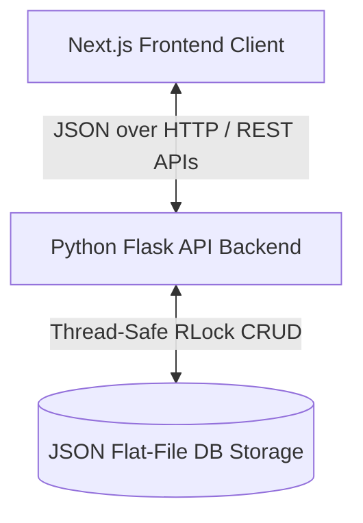
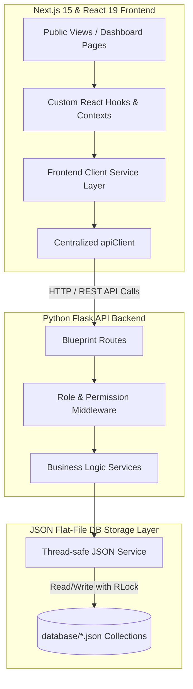

# EstateElite

EstateElite is a premium, state-of-the-art real estate marketplace platform that seamlessly connects buyers, sellers, agents, and administrators. Built with a decoupled architecture, it features a polished, interactive frontend leveraging **Next.js 15** and **React 19** alongside a robust **Python Flask API** backend. The system utilizes a lightweight, flat-file **JSON-based database** with thread-safe file operations for simple, portable, and secure persistence without the overhead of external database servers.

---

## Overview

### Platform Purpose
EstateElite serves as an all-in-one real estate hub designed to streamline property discovery, listings verification, and communication. It replaces fragmented workflows (where property hunters, listing agents, and moderation teams use disconnected tools) with a unified workspace.

### Business Problem Solved
Traditional real estate platforms are often complex to deploy, configure, and maintain due to heavy database and infrastructure dependencies. EstateElite solves this by utilizing a thread-safe, local JSON collection storage model that requires zero external database configurations. It ensures high performance, transactional safety using Python's `threading.RLock`, and rapid load times, making it an excellent blueprint for portable enterprise-level prototypes and lightweight real estate systems.

### Business Workflow
1. **Discovery & Engagement:** Anonymous visitors browse the public marketplace, use dynamic multi-criteria search filters, calculate EMIs, and save listings.
2. **Actionable Interaction:** Registered Users can schedule visits, submit complaints, message agents directly, and list their own properties.
3. **Agent Management:** Registered Agents access a role-guarded dashboard to manage leads, respond to inquiries, and schedule property walkthroughs.
4. **Moderation & Auditing:** Administrators review pending properties, approve or reject them with feedback, and highlight top properties by marking them as "Featured".
5. **System Governance:** Super Administrators monitor service health, adjust system settings, and manage Administrator credentials.

---

## Key Features

### User Features
*   **Premium Marketplace Browsing:** Interactive listing layouts supporting grid/list toggle views, detailed photo galleries, and map markers.
*   **Dynamic Search & Filtering:** Real-time property sorting and multi-criteria filters based on state, city, area, price range, property type, beds/baths, and amenities.
*   **Interactive Property Submission:** A multi-step listing workflow (basic details, location mapping, custom checklists, mock image uploads, and validation summary) that stages a `PENDING` property moderation record.
*   **Saved Properties List:** Keep track of favorite listings on a persistent client-side list synchronized via local storage and database-saved preferences.
*   **Integrated Scheduling & Messaging:** Seamless site visit scheduling and direct inquiries sent directly to assigned agents.
*   **OTP & OAuth Auth Portal:** Secure phone number-based simulated OTP login verification and Google OAuth frontend templates alongside standard password access.

### Agent Features
*   **Agent Dashboard:** An analytics hub showing total properties, active appointments, client messages, and total leads.
*   **Client Lead Management:** Full CRUD operations over sales leads, including contact info, interest tracking, and follow-up status.
*   **Inquiry Messaging System:** View, read, and manage direct buyer messages tied to listings.
*   **Appointment Management:** Real-time appointment review and confirmation workflows.

### Admin Features
*   **Admin Moderation Hub:** A unified, route-guarded administrative interface.
*   **Property Approval Workflow:** A filterable moderation table to dynamically `APPROVE`, `REJECT` (with a custom moderation message), and permanently delete listing documents.
*   **Featured Status Toggles:** Instantly promote listings to the homepage's featured carousel directly from the management table.
*   **Optimistic UI System:** Immediate user feedback on property updates with automatic backend rollback on API error.
*   **User & Agent Directory:** Dynamic tracking and status gauges of registered buyers, sellers, and agents.

### Super Admin Features
*   **Super Admin Dashboard:** Full system data statistics covering users, agents, properties, complaints, appointments, and messages.
*   **Infrastructure Monitoring:** A dedicated health portal reporting backend service indicators, storage layers, and active endpoints.
*   **Global Settings Control:** System-wide settings dashboard to customize platform metadata and feature flags.
*   **Admin Management:** Full CRUD operations for creating, updating, and removing moderation administrators.

---

## Tech Stack

| Layer | Technology | Details |
| :--- | :--- | :--- |
| **Frontend Framework** | **Next.js 15 (App Router)** | Powered by React 19, utilizing Server & Client components for optimal hydration. |
| **Language** | **TypeScript** | Strict type safety for request-response formatting and component interfaces. |
| **Styling & Assets** | **Tailwind CSS v3 & Vanilla CSS** | Clean CSS tokens, custom gradients, glassmorphic UI, and responsive styles. |
| **Client State & Sync** | **React Hooks & Context** | Optimized local state handlers (e.g. `useAdminProperties`) and Context-driven stores. |
| **Backend Framework** | **Python 3.10+ & Flask 3** | Lightweight REST API using modular Blueprints and custom decorators. |
| **Authentication** | **Flask-JWT-Extended** | Secure token handling with custom `@role_required` middleware guards. |
| **Database / Storage** | **JSON Collections** | Thread-safe database emulation utilizing Python's `threading.RLock`. |
| **CORS Handling** | **Flask-CORS** | Configured to support credentials and specify precise origins for secure access. |

---

## System Architecture

EstateElite features a completely decoupled Frontend/Backend configuration, communicating over secure JSON payloads via standard RESTful interfaces.

### Data Flow & Communication
1. **UI Layer:** React components mount and fetch or mutate data through custom hooks (`useAdminProperties`, `useAuth`).
2. **API Client:** Services (`propertyService`, `authService`, `adminService`) abstract the request payload format and rely on `apiClient` to automatically attach JWT authorization headers and enforce request timeouts.
3. **Backend Middleware:** Python Flask decorators intercept requests to parse JWT claims, verify roles (`USER`, `AGENT`, `ADMIN`, `SUPER_ADMIN`), and check account statuses (e.g., block suspended accounts).
4. **Service & Persistent Storage:** Verified requests query or update target JSON data models inside the database. A central mutex (`RLock`) intercepts database writes, blocking race conditions during concurrent accesses.

### Architecture Diagrams

#### 1. High-Level Communication flow


#### 2. Detailed Platform Architecture


---

## Folder Structure

```text
estateelite/
├── backend/                       # Python Flask API Application
│   ├── app.py                     # App factory & blueprint registrations
│   ├── config.py                  # Server configurations & environment variables loading
│   ├── wsgi.py                    # WSGI entrypoint for production servers
│   ├── requirements.txt           # Python backend dependencies
│   ├── middleware/                # Route security & role decorators
│   │   └── permissions.py         # Role verification and account status checks
│   ├── routes/                    # API route blueprints
│   │   ├── auth.py                # Registration, logins, OTP, and token refresh
│   │   ├── properties.py          # Property creation, detail, and admin moderation
│   │   ├── users.py               # User profile settings and saved properties
│   │   ├── agents.py              # Agent dashboards, leads, and status updates
│   │   ├── admins.py              # Admin dashboards and Admin account management
│   │   ├── super_admin.py         # Super-admin settings and health monitoring
│   │   ├── appointments.py        # Booking schedules for property tours
│   │   ├── complaints.py          # User feedback and system ticketing
│   │   ├── messages.py            # Chat messages and property inquiries
│   │   └── content.py             # Public content (testimonials, cities, categories)
│   ├── services/                  # Business logic services
│   │   ├── auth_service.py        # Token signing, hashes, and OTP persistence
│   │   ├── json_service.py        # Thread-safe JSON CRUD layer with RLock
│   │   ├── property_service.py    # Submissions normalizer and validation checks
│   │   ├── user_service.py        # Standard user profiles resolver
│   │   ├── appointment_service.py # Appointment booking state management
│   │   └── complaint_service.py   # System ticket persistence service
│   └── utils/                     # Backend helper methods and schema validators
│       ├── helpers.py             # Response formatters and ISO timestamp generator
│       └── validators.py          # Request payload validators and models
│
├── database/                      # JSON Collections Database
│   ├── admins.json                # Moderation administrator accounts
│   ├── agents.json                # Registered agency accounts
│   ├── appointments.json          # Site visit schedules
│   ├── categories.json            # Property categorizations
│   ├── cities.json                # Geographic selectors
│   ├── complaints.json            # Support and bug tickets
│   ├── leads.json                 # Agent sales inquiries
│   ├── messages.json              # Direct messages between buyers and agents
│   ├── properties.json            # Property listings data models
│   ├── settings.json              # Global platform configurations
│   ├── testimonials.json          # Customer review records
│   └── users.json                 # Customer and guest credentials
│
└── frontend/                      # Next.js App Router Frontend
    ├── app/                       # Page Router Pages & Layouts
    │   ├── (public)/              # Public pages (Home, Properties, Submit Flow)
    │   ├── admin/                 # Admin Login & Moderation Dashboard
    │   ├── agent/                 # Agent Leads, Tour Bookings, and Messages
    │   ├── user/                  # User Dashboard, saved listings, and tickets
    │   ├── super-admin/           # Platform metrics and system settings
    │   ├── auth/                  # Shared Sign-in & Register workflows
    │   ├── unauthorized/          # Redirect layout for invalid security roles
    │   └── globals.css            # Central styles and design variables
    ├── components/                # Modular React UI components
    │   ├── admin/                 # EstateEliteAdmin control panels
    │   ├── agent/                 # Agent dashboard statistics cards
    │   ├── user/                  # User complaints forms
    │   ├── super-admin/           # Settings dashboards and security graphs
    │   ├── forms/                 # Property submitting steps and Login input fields
    │   ├── layout/                # Global Header, Footer, and Sidebar components
    │   └── ui/                    # Custom badges, inputs, buttons, and toasts
    ├── hooks/                     # Custom React Hooks
    │   ├── useAuth.ts             # Auth state and token storage handlers
    │   └── useAdminProperties.ts  # Moderation list mutations & optimistic rollbacks
    ├── lib/                       # Utility functions & API clients
    │   ├── api/                   # Base apiClient config and endpoints lists
    │   ├── services/              # Client wrappers for property and user APIs
    │   ├── api.ts                 # Main unified client API routing object
    │   └── utils.ts               # Tail-wind style merger utilities
    ├── types/                     # Central TypeScript declarations
    └── package.json               # Frontend dependencies & npm execution scripts
```

---

## API Reference

### Public Endpoints
*   `GET /api/public/properties` — Retrieve approved properties.
*   `GET /api/public/properties/<id>` — Retrieve specific approved property details.
*   `POST /api/public/properties/submit` — Submit a property listing (stages as `PENDING`).
*   `GET /api/public/content/cities` — Retrieve available geographic locations.
*   `GET /api/public/content/testimonials` — Retrieve review testimonials.

### Authentication Endpoints
*   `POST /api/auth/login` — Sign in with credentials (returns access token, refresh token, role, and profile details).
*   `POST /api/auth/register` — Standard registration for new buyers/sellers.
*   `POST /api/auth/otp/send` — Triggers a 6-digit phone verification OTP (printed to backend console logs).
*   `POST /api/auth/otp/verify` — Validates the phone OTP payload.
*   `POST /api/auth/refresh` — Requests a new access token using a valid JWT refresh token.
*   `POST /api/auth/logout` — Destroys current session.

### Guarded User Endpoints (Requires `Bearer` token)
*   `GET /api/users/me` — Retrieve current authenticated profile.
*   `PATCH /api/users/me/saved-properties` — Toggle a property ID inside the user's `savedProperties` array.
*   `POST /api/appointments` — Request a site visit tour.
*   `GET /api/appointments/my` — Retrieve the user's booked site tours.

### Guarded Agent Endpoints (Requires `AGENT` role)
*   `GET /api/agents/dashboard` — Retrieve agent statistics.
*   `GET /api/agents/leads` — List buyer/seller lead profiles.
*   `POST /api/agents/leads` — Create a sales lead.
*   `PATCH /api/agents/leads/<id>` — Update lead details.
*   `DELETE /api/agents/leads/<id>` — Delete a lead document.

### Guarded Admin Endpoints (Requires `ADMIN` or `SUPER_ADMIN` role)
*   `GET /api/admin/properties` — List all properties regardless of status.
*   `PATCH /api/admin/properties/<id>/approve` — Approve listing (status → `APPROVED`).
*   `PATCH /api/admin/properties/<id>/reject` — Reject listing (status → `REJECTED`, optional reason support).
*   `PATCH /api/admin/properties/<id>/feature` — Toggle property featured status.
*   `DELETE /api/admin/properties/<id>` — Permanently delete listing document.

### Guarded Super Admin Endpoints (Requires `SUPER_ADMIN` role)
*   `GET /api/super-admin/dashboard` — Fetch complete platform collection statistics.
*   `GET /api/super-admin/monitoring` — Fetch platform services and database health status.
*   `GET /api/super-admin/settings` — Read global settings configurations.

---

## Getting Started

### Prerequisites
*   **Node.js**: `v18.0.0` or higher
*   **Python**: `v3.10.0` or higher

### Environment Variables

#### Frontend Setup (`frontend/.env.local`)
Create a `.env.local` file inside the `frontend/` folder:
```env
NEXT_PUBLIC_API_URL="http://localhost:5000"
NEXT_PUBLIC_GOOGLE_CLIENT_ID="your-google-oauth-client-id"
JWT_SECRET="your-local-development-jwt-key"
```

#### Backend Setup (`backend/.env`)
Create a `.env` file inside the `backend/` folder:
```env
SECRET_KEY=change-me-in-production
JWT_SECRET_KEY=change-me-in-production
PORT=5000
CORS_ORIGINS=http://localhost:3000,http://127.0.0.1:3000
```

---

### Installation & Run

#### 1. Start the Flask API Backend
1.  Navigate to the backend directory:
    ```bash
    cd backend
    ```
2.  Create and activate a Python virtual environment:
    ```bash
    # Windows:
    python -m venv venv
    venv\Scripts\activate

    # macOS/Linux:
    python3 -m venv venv
    source venv/bin/activate
    ```
3.  Install backend dependencies:
    ```bash
    pip install -r requirements.txt
    ```
4.  Run the Flask API Server:
    ```bash
    python app.py
    ```
    The API server will run at: `http://localhost:5000`

#### 2. Start the Next.js Frontend
1.  Navigate to the frontend directory:
    ```bash
    cd frontend
    ```
2.  Install dependencies:
    ```bash
    npm install
    ```
3.  Run the development server:
    ```bash
    npm run dev
    ```
    The frontend client will open at: `http://localhost:3000`

#### 3. Build & Verify
*   **Type-check TypeScript components:**
    ```bash
    npm run type-check
    ```
*   **Compile frontend production build:**
    ```bash
    npm run build
    ```
