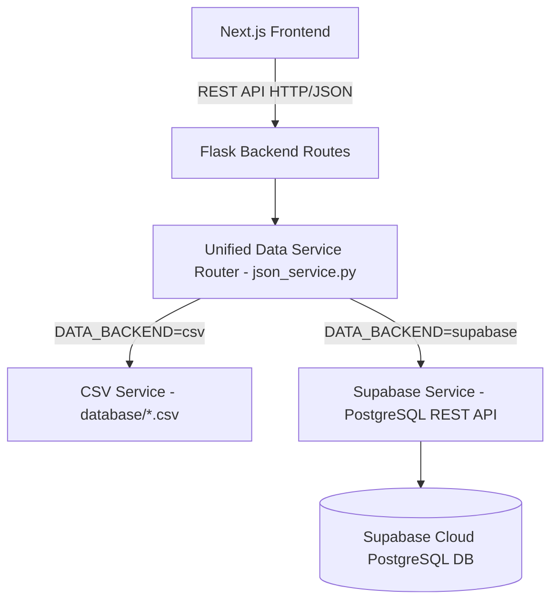

# 🚀 Complete Supabase Migration Guide for ManishProperties / EstateElite

This document provides a step-by-step, phase-wise guide to migrating the entire ManishProperties backend and database from local CSV storage to a high-performance **Supabase PostgreSQL** cloud database.

---

## 📋 Table of Contents
1. [Migration Architecture](#1-migration-architecture)
2. [Database Schema Overview (16 Tables)](#2-database-schema-overview)
3. [Phase 1: Run SQL in Supabase SQL Editor](#3-phase-1-run-sql-in-supabase-sql-editor)
4. [Phase 2: Configure Backend Environment Variables](#4-phase-2-configure-backend-environment-variables)
5. [Phase 3: Verify All Application Functionalities](#5-phase-3-verify-all-application-functionalities)
6. [Phase 4: Direct Realtime & Client Capabilities (Optional)](#6-phase-4-direct-realtime--client-capabilities-optional)
7. [Zero-Downtime Rollback Plan](#7-zero-downtime-rollback-plan)

---

## 1. Migration Architecture

The backend implements a **Dual-Engine Adapter Layer** in [`backend/services/json_service.py`](file:///C:/Users/Admin/Desktop/All%20websites/InnovateHive/ManishProperties/backend/services/json_service.py):



### Key Highlights:
- **Zero Route Changes Needed**: All routes (`auth`, `properties`, `users`, `agents`, `admins`, `cities`, `appointments`, `enquiries`, `complaints`, `notifications`) continue working seamlessly.
- **Auto-Switching**: When `SUPABASE_URL` and `SUPABASE_KEY` are provided, the backend automatically communicates with Supabase.
- **Safe Fallback**: If `DATA_BACKEND=csv` is set, it immediately falls back to local CSV files.

---

## 2. Database Schema Overview

All 16 collections are mapped to PostgreSQL relational tables with exact column types, primary keys, JSONB support for arrays/nested objects, and performance indexes:

| Table Name | Description | Key Fields & Types |
| :--- | :--- | :--- |
| `admins` | Platform & City Administrators | `id` (PK), `username`, `email`, `passwordHash`, `role`, `savedProperties` (JSONB) |
| `agents` | Real Estate Agents & Sub-area assignments | `id` (PK), `username`, `email`, `passwordHash`, `city_id`, `sub_area_ids` (JSONB), `status` |
| `users` | Registered Clients / Buyers | `id` (PK), `email`, `name`, `phone`, `role`, `savedProperties` (JSONB), `agentRatings` (JSONB) |
| `properties` | Property Listings & Metadata | `id` (PK), `title`, `priceNum`, `city_id`, `sub_area_id`, `amenities` (JSONB), `images` (JSONB), `featured` (BOOL) |
| `cities` | Supported Operating Cities | `id` (PK), `name`, `image`, `admin_id`, `status`, `count` |
| `sub_areas` | Micro-locations / Neighborhoods | `id` (PK), `name`, `city_id`, `slug`, `agent_ids` (JSONB) |
| `appointments` | Property Visits & Consultations | `id` (PK), `propertyId`, `userId`, `agentId`, `date`, `time`, `status`, `type` |
| `enquiries` | Property Inquiries & Leads | `id` (PK), `propertyId`, `userName`, `userEmail`, `agentId`, `message`, `status` |
| `complaints` | Moderation, Flagged Listings & Reports | `id` (PK), `propertyId`, `userId`, `subject`, `status`, `resolutionNotes`, `resolvedAt` |
| `featured_plans` | Monetization & Tier Plans | `id` (PK), `name`, `duration`, `price`, `features` (JSONB) |
| `notifications` | User & Agent Realtime Alerts | `id` (PK), `userId`, `userType`, `title`, `message`, `isRead` (BOOL), `actionUrl` |
| `testimonials` | Landing Page Client Reviews | `id` (PK), `name`, `role`, `rating`, `content`, `avatar` |
| `categories` | Listing Categories & Home Statistics | `id` (PK 'main'), `data` (JSONB) |
| `settings` | System Platform Settings | `id` (PK 'main'), `data` (JSONB) |
| `leads` | Direct Agent Leads Pipeline | `id` (PK), `agentId`, `name`, `email`, `phone`, `propertyId`, `status` |
| `messages` | Internal Messages & Communication | `id` (PK), `senderId`, `receiverId`, `content`, `isRead` (BOOL) |

---

## 3. Phase 1: Run SQL in Supabase SQL Editor

We have prepared the complete SQL script containing **Table Creation (DDL)**, **Row Level Security (RLS)**, **Seed Data (DML)**, and **Performance Indexes**:

### Step 1.1: Open Supabase Project
1. Log in to [Supabase Console](https://supabase.com/dashboard).
2. Create a new project or select your existing project.
3. In the left navigation sidebar, click on **SQL Editor**.

### Step 1.2: Execute the Migration Script
1. Click **+ New Query**.
2. Open the generated file [`supabase_schema_and_data.sql`](file:///C:/Users/Admin/Desktop/All%20websites/InnovateHive/ManishProperties/supabase_schema_and_data.sql) in your project root.
3. Copy all contents and paste them into the Supabase SQL Editor.
4. Click **Run** (or press `Ctrl + Enter` / `Cmd + Enter`).
5. Verify in the output pane that all tables and rows are inserted successfully (`Success. No rows returned`).

### Step 1.3: Verify in Table Editor
1. In the Supabase sidebar, click on **Table Editor**.
2. You will see all 16 tables (`properties`, `users`, `agents`, `admins`, `cities`, `sub_areas`, `appointments`, `complaints`, etc.) populated with the existing data.

---

## 4. Phase 2: Configure Backend Environment Variables

### Step 2.1: Get Supabase API Credentials
1. In your Supabase Project dashboard, go to **Project Settings** (gear icon) ➔ **API**.
2. Copy the following keys:
   - **Project URL**: `https://<your-project-id>.supabase.co`
   - **Project API Keys**:
     - `anon` `public` key
     - `service_role` `secret` key *(Use this for the backend for administrative database access)*

### Step 2.2: Update Backend `.env` File
In your `backend/.env` (or hosting environment variables on Render / Railway):

```ini
# ==============================================================================
# Supabase Database Configuration
# ==============================================================================
DATA_BACKEND=supabase
SUPABASE_URL=https://<your-project-id>.supabase.co
SUPABASE_KEY=<your-anon-or-service-role-key>
SUPABASE_SERVICE_ROLE_KEY=<your-service-role-secret-key>
```

---

## 5. Phase 3: Verify All Application Functionalities

Run the backend verification check:

```powershell
# Test backend locally with Supabase
cd backend
python app.py
```

### Critical Endpoints to Verify:
1. **Health Check**:
   - `GET http://localhost:5000/health` ➔ Returns `{"status": "healthy"}`
2. **Properties Listing**:
   - `GET http://localhost:5000/api/properties` ➔ Returns all properties from Supabase.
3. **Cities & Sub-areas**:
   - `GET http://localhost:5000/api/cities` ➔ Returns city listings and assigned sub-areas.
4. **Authentication**:
   - `POST http://localhost:5000/api/auth/login` ➔ Authenticates against `admins`/`agents`/`users` tables in Supabase.
5. **Appointments & Enquiries**:
   - Submitting an appointment or enquiry creates a row directly in Supabase.
6. **Admin Dashboard**:
   - Updating statuses, approving agents, and managing listings syncs in real-time.

---

## 6. Phase 4: Direct Realtime & Client Capabilities (Optional)

If you wish to enable direct Supabase client capabilities in Next.js in the future:
1. Install `@supabase/supabase-js` in the frontend:
   ```bash
   npm install @supabase/supabase-js
   ```
2. Configure `NEXT_PUBLIC_SUPABASE_URL` and `NEXT_PUBLIC_SUPABASE_ANON_KEY` in `.env.local`.
3. Use Supabase Realtime subscriptions to listen to live notifications, appointments, or messages.

---

## 7. Zero-Downtime Rollback Plan

If you ever need to temporarily switch back to local CSV storage during maintenance:
1. In `backend/.env`, set:
   ```ini
   DATA_BACKEND=csv
   ```
2. Restart the Flask backend. The backend will instantly resume reading and writing to `database/*.csv` without any interruptions.

---

### Need to Re-generate SQL or Fresh Seed?
Run the built-in generator anytime from the workspace root:
```powershell
python backend/scripts/generate_supabase_sql.py
```
